# Pi Sentinel

All-sky camera meteor detection and display software for the Raspberry Pi.

## Hardware 

The Pi Sentinel software is currently being used with the following hardware:

* Raspberry Pi 4 Model B 2GB with 32GB SD card
* USB Camera - SVPRO Mini USB Webcam 1920 1080P IMX322 180 Degree Wide Angle Digital Low Illumination 0.01 lux Industrial USB Camera 
HD 2mp for Automatic Vending Machines
* USB Cable - C2G 38988 USB Active Extension Cable - USB 2.0 A Male to A Female Cable, Center Booster Format, 
Black (25 Feet, 7.62 Meters)
* Raspberry Pi USB 3.0 Hub - 4 port USB hub
* Power Supply - CanaKit USB-C Power Supply, 2 each: One for the Raspberry Pi and one for the USB hub
* GPS Module - VFAN USB GPS Receiver Antenna Gmouse for Laptop PC Car Marine Navigation Magnetic Base
* External USB drive - Used for the video archive

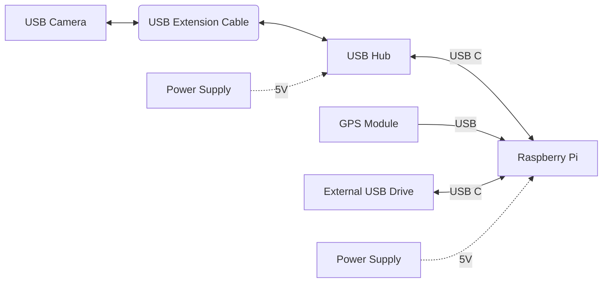

The camera has a fisheye lens but the full sky image is somewhat cropped at the top and bottom. 

I wanted to have the camera far away from the Raspberry Pi, but since USB cables are not designed to work over long distances, I am using an Active Extension Cable that has built in circuitry to boost the signal.

## Quick Start

Do this after installing the libraries mentioned above

* Get the Pi Sentinel software:

`git clone https://github.com/chavezaurus/pi-sentinel5.git`

* Enter into Pi Sentinel directory:

`cd pi-sentinel5`

* Install all the dependencies.  This might take a while to complete but it only needs to be done once:

`./install.sh`

* Start Pi Sentinel and the web server.  This may take a while to complete, but only the first time.

`./startj.sh` (or `./start.sh` if using a different GPS module)

Now you can open your web browser and connect to the IP address of your Raspberry Pi using port 9090.  Yours may be different but on my browser the address looks like this:

```http://192.168.1.20:9090```

To stop pi-sentinel, you can type the following:

`tmux kill-session`

## User Interface

The Pi-Sentinel software provides a web interface which allows the user to control the software and view events with just a web browser.  I am currently using Firefox on a Mac, which is on the same WiFi network as the Raspberry Pi.

The interface consists of an image/video panel on the right and a control panel on the left.  The image panel is where event videos and images are shown.  The control panel lets you control the Pi Sentinel software and examine events produced by Pi Sentinel.  The control panel is made up of three panes (**Events**,**Controls**,**Cals**) that you can view one at a time by clicking one of the three buttons at the top.  The first pane (**Events**) lets you see all the events captured by Pi Sentinel and select each event for examination.  The second pane (**Controls**) lets you  control various aspects of the software and view status information. The third pane (**Cals**) lets you see additinal panes that are used when performing calibrations.  These will be described later.

### Events Pane

Press the **Events** button to select the **Events Pane** as shown below.

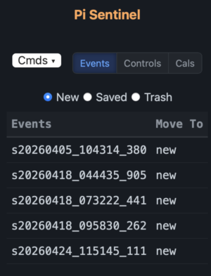

The **Events Pane** contains three selection radio buttons (**New, Saved, Trash**), used to select one of three directories (`new`, `saved`, `trash`) containing event files.  When events occur, they are automatically placed in the `new` directory.  The left column shows a list of time strings associated with each event. The time string indicates the UTC time that the event occurred.  To view the event, click on the time string.  If a composite image is available, it will be shown first.  Clicking the time string again will then show the video of the event.  If you continue to click the time string, you will toggle between showing the composite image and the video.  If a composite image is not available, only the video of the event will be displayed.

The second column in the table lets you specify into which directory you would like to move the associated event. At first, all the rows indicate `new`, which means the event stays in the `new` directory.  If you click the `new` cell, it will change to `trash` indicating that the associated event will be moved to the `trash` directory.  If you click the cell again, it will change to `saved` which means the event will be moved to the `saved` directory.  Clicking the cell again changes it back to `new`, which is where you started.  This lets you quickly scan through all new events and decide where each event belongs.  The actual movement occurs when the **Events** button is pressed or if any one of the selection buttons (**New, Saved, Trash**) is pressed.

Similarly, if you select the **Saved** button, you will see a table containing all the events that are in the `saved` directory.  These events can be examined and moved just like events in the `new` directory.  You can also examine and move events in the `trash` directory by selecting the **Trash** button.

### Control Pane

Press the **Controls** button to select the **Controls Pane** as shown below.  This pane contains status information and various settings used to control the operation of the Pi Sentinel software.

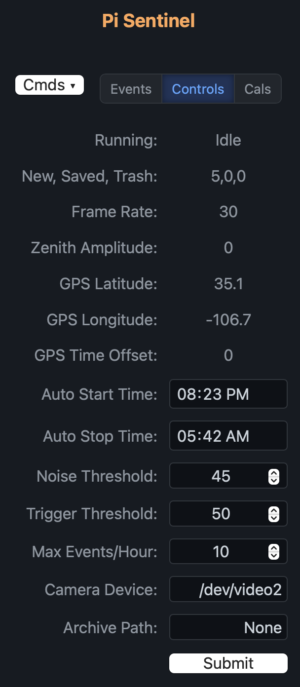

* **Running** - This shows the running state of the Pi Sentinel software.  It can be one of the following
  * **Idle** - The software is not watching for meteors or running other processing tasks.
  * **Watching** - The software is watching for meteors.
  * **Triggered** - The software has been triggered and is now processing the event.
  * **Compose** - The software is creating a composite image from the video data.
  * **Analyze** - The software is creating a CSV file from the video data.
  * **Stargaze** - The software is processing archived video data to produce a star image
  
* **New, Saved, Trash** - This provides three numbers that indicate how many events are in the *new* directory, the *saved* directory, and the *trash* directory, respectively.  All new events are automatically placed in the *new* directory and it is up to the user to move them to one of the other directories.
* **Frame Rate** - If Pi Sentinel is processing camera data, this indicates the frame rate (in frames per second) being generated by the camera.  The frame rate can change if the light level changes or if Pi Sentinel controls the rate itself.
* **Zenith Amplitude** - If the Pi Sentinel is processing camera data, this is an estimate of the light brightness at the zenith.  It is produced by sampling a set of pixels near the center of the image.  This estimate is sometimes used by Pi Sentinel to control exposure time.
* **GPS Latitude** - This is the latitude provided by the GPS module, if present.
* **GPS Longitude** - This is the longitude provided by the GPS module, if present.
* **GPS Time Offset** - This is the difference between the time provided by the GPS module and the system time provided by the Raspberry Pi's internal clock.
* **Auto Start Time** - This is the browser local time at which Pi Sentinel will start processing camera data.  Typically, this is when you might expect to start seeing meteors.  Local time is with respect to the browser and may not be the local time with respect to the camera, which may be located remotely.
* **Auto Stop Time** - This is the browser local time at which Pi Sentinel will stop processing camera data.  If both the Start Time and Stop Time are set to the same time, then neither action will occur and you will need to start or stop processing manually. Local time is with respect to the browser and may not be the local time with respect to the camera, which may be located remotely.  As a convenience, when the Pi Sentinel stops processing camera data at the Auto Stop Time, it will automatically start generating Composite Images and CSV files for all events in the New directory.
* **Noise Threshold** - Pixels values that are less than this number above background are ignored.
* **Trigger Threshold** - If the sum of pixel values that are more than the noise threshold above background exceeds this number, then a trigger is initiated and an event is produced.
* **Max Events Per Hour** - The nominal maximum number of events that can be produced per hour.  The way this works can be explained with an example.  Suppose that the Max Events Per Hour is set to 5.  When processing begins, Pi Sentinel has a starting credit of 5 events.  Every time an event occurs, the credit is reduced by 1.  If the credit reaches 0, no more events are allowed.  However, one credit is added every 12 minutes (1/5 hour) up to a maximum of 5 credits.
* **Camera Device** - This specifies which video device is being used by the Raspberry Pi to connect to the camera.  This will typically be `/dev/videoN` where N is some number.  Cameras often connect to several devices if they provide several different data formats.  For Pi Sentinel you need to connect to the device that provides H264 formatted data.
* **Archive Path** - This specifies the full path to the directory that will contain the archive, which is all the video that the camera produces while Pi Sentinel is watching for meteors.  If you do not wish to archive all the video, the path should be specified as: None.

Next is the **Submit** button.  If you change one of the parameters above, you must click this button to have these changes submitted to Pi Sentinel.

### Cmds Button

At the top of the left panel, you will also see the **Cmds** pull-down menu button.  If you press the **Cmds** button, you will see drop-down commands, as shown below:

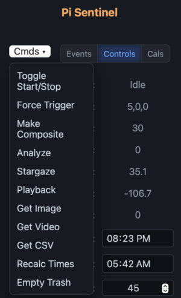

* **Toggle Start/Stop** - This command toggles the running state of Pi Sentinel between **Idle** and **Watching**.  That is, if the running state is **Idle**, this command will cause Pi Sentinel to start watching for meteors.  If the running state is **Watching**, this command will cause Pi Sentinel to stop watching and return to the **Idle** state.

* **Force Trigger**  - This command triggers an immediately event which produces a video file as if the camera saw a real meteor.  This command works only when Pi Sentinel is in the **Watching** state.

* **Make Composite** - This command produces a composite image from the most recently selected event video.  This takes a while to complete, during which Pi Sentinel will be in the **Compose** state.  An alert will appear when the action has completed.  This command works only when Pi Sentinel starts out in the **Idle** state.

* **Analyze** - This command produces a CSV file (comma separated variable) that contains a time history of the event.  This takes a while to complete, during which Pi Sentinel will be in the **Analyze** state.  An alert will appear when the action has completed.  This command works only when Pi Sentinel starts out in the **Idle** state.  Each line of the file includes the following information about each frame of the video:
  
  * A time string indicating the time of the frame
  * The number of pixels in the frame that are above the noise threshold
  * The sum of the pixel values above the noise threshold
  * The X coordinate of the centroid of the pixel values above the noise threshold
  * The Y coordinate of the centroid of the pixel values above the noise threshold
  * The calculated azimuth coreesponding to the centroid
  * The calculated elevation corresponding to the centroid

  
  Ideally, you should see pixel values above the noise threshold only when a meteor is present.  However, if examining the CSV file shows many pixels with values above the noise threshold at other times, you should consider raising the **Noise Threshold** value in the **Controls** pane and then remaking the CSV file.  

* **Stargaze** - This command produces a image of the sky using video data from the archive, which is processed and enhanced to reveal faint stars and planets that are not normally visible.   A dialog is opened, as shown below, allowing the user to select a date and time.  A one minute file of archive data from the selected time is then used to create the star/planet image.  The process works as follows:  All frames from the first half minute of video are summed and then an equal number of frames from the second half minute are subtracted.  The result is then scaled.   In theory, all static features and noise accumulated during the first half are cancelled out by subtracting the frames from the second half.  However, the light from stars accumulated during the first half will not be cancelled out when the frames from the second half are subtracted because the stars will have moved slightly during that time. The resulting image is placed in the **Calibration** directory.

  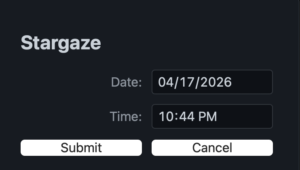

  An alert will appear when the action has completed.  This command works only when Pi Sentinel starts out in the **Idle** state.

* **Playback** - This command lets the user generate events using data from the archive.  A dialog appears as shown below:

  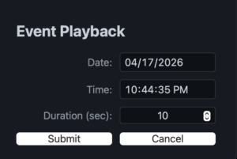

  The user can select a date, time and duration of the event.  If video data from the selected time and duration are in the archive, an event is generated as if a genuine meteor event was detected at that time.  This can be useful if Pi Sentinel did not see a meteor at a certain time but we have indications from other sources that a meteor occurred.  Perhaps the threshold was not set correctly or the maximum number of events per hour limit was already exceeded.  For convenience, the Date and Time are initialized to the time of the last event selected.  
* **Get Video** - This command  fetches the most recently viewed video to local storage.  On my Mac I use this to bring the video file from the Raspberry Pi to the Mac.

* **Get Image** - This command fetches the composite image of the most recently viewed event (if it is available) to local storage.  If the composite image is not available, it can be produced from the video file using the **Make Composite** command.

* **Get CSV File** - This fetches the CSV file of the most recently viewed event (if it is available) to local storage.  If the CSV file is not available, it can be produced from the video file using the **Analyze** command.

* **Recalc Times** - This command will calculate the Auto Start Time and the Auto Stop Time based on the current times of sunrise and sunset at the camera's current location.  A dialog appears as shown below which allows you to specify the minutes of twilight.  The Auto Start Time is then set to the specified number of minutes of twilight after sunset, and the Auto Stop Time is set to the specified number of minutes of twilight before sunrise. This command can be invoked periodically throughout the year to accommodate the changing amount of darkness as the seasons change.

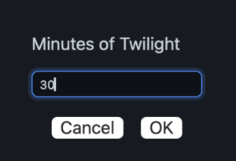

* **Empty Trash** - This command deletes all files in the **Trash** directory.

### Cals Pane

Press the **Cal** button to select the **Cal Pane**.  This pane actually combines three panes associated with Calibration.  These panes are selected with the selector button at the top left with the following options: **Params**, **Images**, and **Samples**.  When **Params** is selected, the following pane is shown:

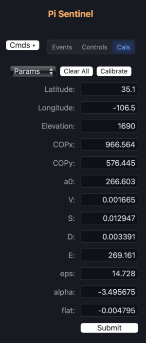

The **Params** pane presents all the parameters of the Borovicka calibration equation that are used to calibrate the view, that is, to map each point in the image view to a true Azimuth and Elevation, taking into account the positioning of the camera and the distortion of the lens.  We derive these parameters by matching acquired images of stars and planets with their known positions in the sky from the point of view of the camera at the time the images were taken.  To verify that the calibration is correct, we can overlay markers or the calculated position of stars and planets (using the Borovicka parameters) onto the corresponding sky image. This allows us to compare the calculated positions with the actual positions.  As a convenience, we also overlay the calculated positions of the cardinal directions (North, South, East, and West) and the Zenith direction.  The overlay is enabled by clicking the **Show Stars** checkbox at the bottom of the view area.  The star positions are shown as red circles and the directions are shown as red dots.

Calibration involves selecting the image of a star or planet and identifying which star or planet corresponds to that image.  At the beginning, it can be difficult knowing the identity of each star image, so do the following:

- Set **Latitude**, **Longitude**, and **Elevation**.  These specify the location of the camera taking the image.
- Set **COPx** and **COPy**. These are the pixel coordinates of the Center of projection of the camera image.  If the camera is pointed straight up then **COPx** should be around 960 and **COPy** should be around 540.
- Set **a0**.  This indicates the rotation of camera in degrees. If the top of the image is due North then this number should be around 0.  If the top of the image is due East then this number should be around 90.
- Set **V**.  This indicates the magnification of the image.  It is the first-order angular size of each pixel near the center of the image, in radians per pixel. This should be around 0.002.
- Set all other parameters to 0 

Now select the **Images** pane, which should look like the following:

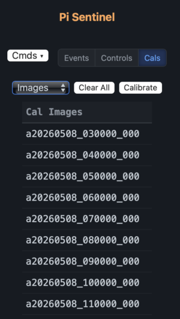

Here we see a list of all Stargazer images that have been produced from archive data. These are images that were either created using the **Stargaze** command or were created automatically nightly by the Pi Sentinel software. The list item indicates the date and time of the image.  If the sky was clear when the data were taken, some of these images may contain points of light that can be identified as stars or planets. Clicking on a list item will show the image in the viewing area. If you turn on the **Show Stars** checkbox, you will see circles where the software expects the stars or planet to be, based on the parameters in the Borovicka calibration equation. When calibration is successful, the stars and planets will coincide with their expected locations. This is shown in the partial image below.

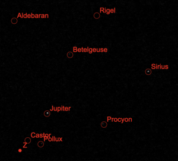

Of course, not all stars and planets will produce a recognizable image.  This depends on the brightness of the star or planet, and on how clear the sky is at the time the data were collected. 

When first starting out, the star and planet images will not be in their corresponding circles, but by manually modifying the Borovicka parameters (**a0**, **COPx**, **COPy**) you should be able to get the star images reasonable close to their corresponding circles.  This is especially true if you have an event image that contains the Moon, which is easily recognizable.

The next step is to create a list that matches star/planet locations in the image with their true locations in the sky.  For example, if you have an image that has a bright spot that you are pretty confident is Jupiter, and you have adjusted the Borovicka parameters so that the red circle labeled Jupiter is near the bright spot, then carefully click the bright spot.  You will get a dialog like the following:

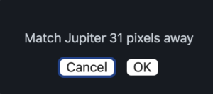

The program lets you verify that you are identifying the bright spot as Jupiter. Continue this with other bright spots on other images to get a full list. The more the better. To see the list, select the **Samples** option. This looks like this;

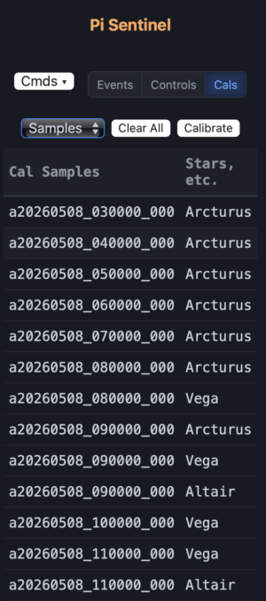

If one of the list elements was created in error, you can click on the list element to remove it.

After enough measurements have been selected, press the `Calibrate` button.  This sends the measurement data to the Pi Sentinel software, which performs an optimization to find the set of calibration parameters that best fits the measurements.  This set is returned and replaces the calibration parameters. The overlay showing star/planet locations is also updated. If calibration is successful then all star images will be within the red circles that show their expected locations.

## Mask File

The mask file is used to specify areas of the image that should be ignored.  The mask file contains an image of the camera field of view in which the areas to be ignored are painted red.  The image should be saved as `mask.jpg` (JPEG format) in the same directory as `sentinel.py`.  

To produce this file, I started with an event video (either naturally occurring or forced) and created a composite JPEG image file. Many applications can be used to edit the image file to produce the mask file.  On the Mac, I used the freely available ImageJ application, which is a Java application that also runs on other platforms.

The mask file is read by the sentinel program every time it starts.

## Contact

J C Chavez chavezaurus@gmail.com
